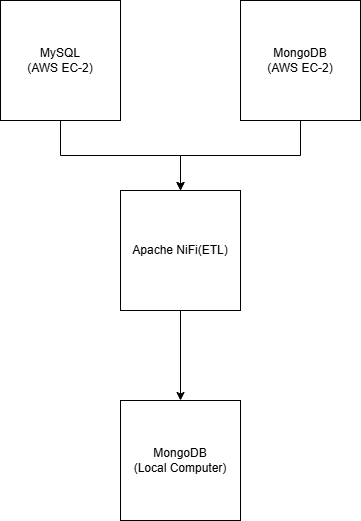
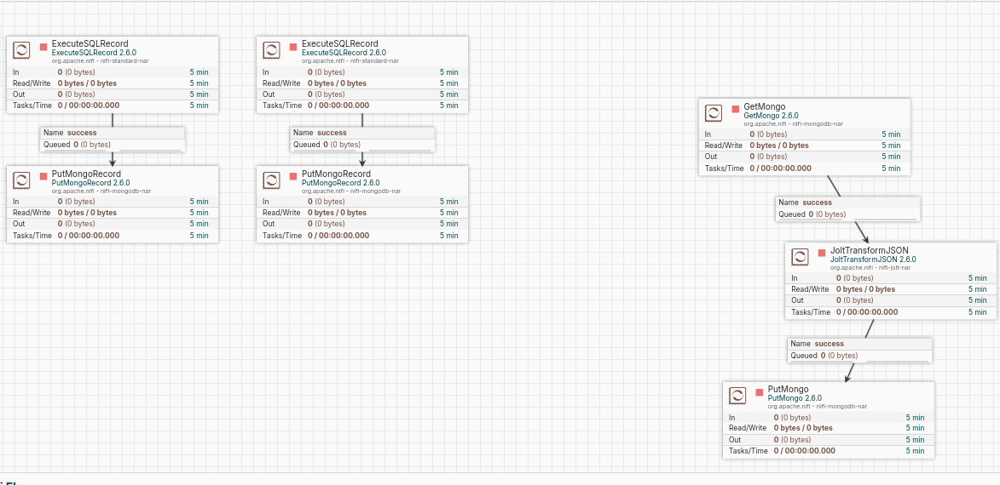
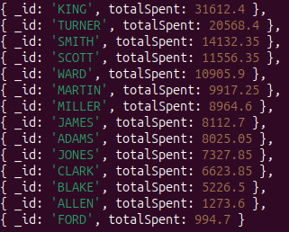
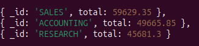
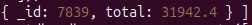

# ETL Pipeline with Apache NiFi and MongoDB (AWS EC2)
## 📌 Project Overview

This project implements an ETL (Extract-Transform-Load) pipeline using Apache NiFi to collect data from two different cloud data sources and consolidate them into MongoDB in JSON format.
The system demonstrates distributed data ingestion, transformation and analytics.

## 🧱 System Architecture

Data Sources:
- EC2 Instance 1 → MongoDB
- EC2 Instance 2 → MySQL
ETL Tool:
- Apache NiFi
Destination:
- Local MongoDB




## 📂 Data Sources

CSV files provided:
- expense.csv
- emp.csv
- dept.csv
Initial loading:
- expense.csv stored in MongoDB (EC2)
- emp.csv and dept.csv stored in MySQL (EC2)

## 🔄 ETL Pipeline (NiFi Flow)

The NiFi pipeline performs:
1️⃣ Extract data from MongoDB (EC2)

2️⃣ Extract data from MySQL (EC2)

3️⃣ Convert records into JSON format

4️⃣ Merge/transform data where necessary

5️⃣ Load processed data into local MongoDB database (`targetdb`)

The NiFi flow definition is available in `nifi/nifi-flow.json`.

## 🗄️ Destination Database

Database Name:
targetdb
Collections:
- expenses
- emp
- dept
All data stored in JSON format.

## 🧠 Analytical Queries (MongoDB Aggregation)

The following analytical questions were answered:

 ### 1️⃣ Who (with name) spends how much for food or appliances?
 Using aggregation with `$lookup` and `$group`.
 ### 2️⃣ Which department made the most purchases?
 Aggregation pipeline joining:
 - expense
 - emp
 - dept
 ### 3️⃣ Who spent the most?
 Grouping expenses by employee and sorting descending.

## 📊 Example Aggregation (Simplified)

Aggregation queries are available in `mongodb/aggregation.js`.

```javascript
db.expenses.aggregate([
  {
    $lookup: {
      from: "emp",
      localField: "empno",
      foreignField: "empno",
      as: "employee"
    }
  },
  { $unwind: "$employee" },
  {
    $group: {
      _id: "$employee.ename",
      totalSpent: { $sum: "$payment" }
    }
  },
  { $sort: { totalSpent: -1 } }
])
```

## 🛠️ Technologies Used

-AWS EC2
-MongoDB
-MySQL
-Apache NiFi
-JSON Data Processing
-MongoDB Aggregation Framework


## Screenshots

### NiFi Flow



### MongoDB Result





## 🚀 How to Run

1️⃣ Start MongoDB (source EC2)

2️⃣ Start MySQL (source EC2)

3️⃣ Start Apache NiFi

4️⃣ Execute NiFi pipeline

5️⃣ Verify data loaded into local MongoDB (targetdb)

6️⃣ Run aggregation queries

## 🎯 Learning Outcomes

-Cloud-based distributed data ingestion

-ETL pipeline design using NiFi

-Data transformation to JSON

-MongoDB aggregation & joins ($lookup)

-Multi-source data consolidation
